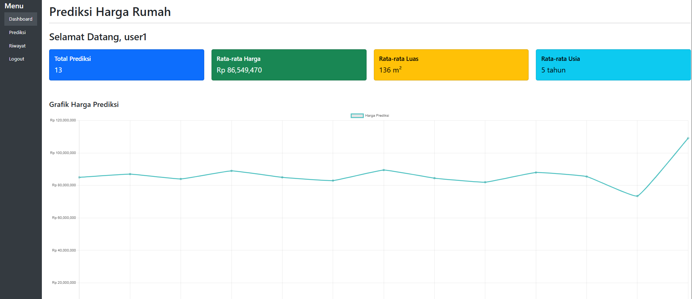
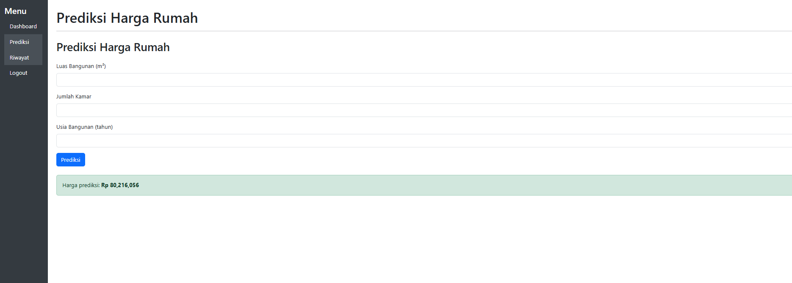
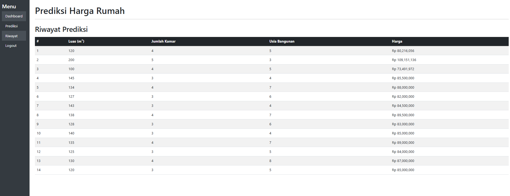

<<<<<<< HEAD
# Prediksi Harga Rumah

Aplikasi web sederhana menggunakan Flask untuk memprediksi harga rumah berdasarkan luas bangunan, jumlah kamar, dan usia bangunan. Model prediksi menggunakan machine learning yang sudah dilatih dan disimpan dalam file `model.pkl`.

## Fitur

- Registrasi dan login pengguna
- Input data rumah untuk prediksi harga
- Menyimpan riwayat prediksi per pengguna
- Dashboard dengan statistik dan grafik prediksi harga
- Proteksi halaman agar hanya pengguna terautentikasi yang bisa mengakses

## Teknologi

- Python 3.x
- Flask
- PostgreSQL
- scikit-learn (model machine learning)
- Chart.js (visualisasi grafik)
- Bootstrap 5 (UI)

## Cara Instalasi

1. Clone repository ini:

   ```bash
   git clone https://github.com/username/prediksi_harga_rumah.git
   cd prediksi_harga_rumah
   ```

2. Buat dan aktifkan virtual environment:

   ```bash
   python -m venv env
   source env/bin/activate  # Linux/macOS
   env\Scripts\activate     # Windows
   ```

3. Install dependencies:

   ```bash
   pip install -r requirements.txt
   ```

4. Pastikan PostgreSQL sudah berjalan dan buat database prediksi_db. Sesuaikan koneksi database di app.py jika perlu.

5. Jalankan aplikasi
   ```bash
   flask run
   ```
6. Buka browser dan akses:
   ```cpp
   http://127.0.0.1:5000/
   ```
## Tampilan Aplikasi




## Strktur Database (PostgreSQL)
   - users: Menyimpan data pengguna (id, username, password)
   - rumah: Menyimpan data prediksi rumah (id, luas_bangunan, jumlah_kamar, usia_bangunan, harga, user_id)

## Catatan
   - Ganti app.secret_key di app.py dengan key yang lebih aman untuk produksi.
   - Pastikan model.pkl tersedia di folder project.
   - Password saat registrasi saat ini belum di-hash, untuk keamanan lebih baik gunakan hashing seperti werkzeug.security.

## Lisensi
MIT License
=======
\# Prediksi Harga Rumah


Aplikasi web sederhana menggunakan Flask untuk memprediksi harga rumah berdasarkan luas bangunan, jumlah kamar, dan usia bangunan. Model prediksi menggunakan machine learning yang sudah dilatih dan disimpan dalam file `model.pkl`.


\## Fitur


\- Registrasi dan login pengguna

\- Input data rumah untuk prediksi harga

\- Menyimpan riwayat prediksi per pengguna

\- Dashboard dengan statistik dan grafik prediksi harga

\- Proteksi halaman agar hanya pengguna terautentikasi yang bisa mengakses


\## Teknologi


\- Python 3.x

\- Flask

\- PostgreSQL

\- scikit-learn (model machine learning)

\- Chart.js (visualisasi grafik)

\- Bootstrap 5 (UI)


\## Cara Instalasi


1\. Clone repository ini:


&nbsp;  ```bash

&nbsp;  git clone https://github.com/username/prediksi\_harga\_rumah.git

&nbsp;  cd prediksi\_harga\_rumah

&nbsp;  ```


2\. Buat dan aktifkan virtual environment:


&nbsp;  ```bash

&nbsp;  python -m venv env

&nbsp;  source env/bin/activate  # Linux/macOS

&nbsp;  env\\Scripts\\activate     # Windows

&nbsp;  ```


3\. Install dependencies:


&nbsp;  ```bash

&nbsp;  pip install -r requirements.txt

&nbsp;  ```


4\. Pastikan PostgreSQL sudah berjalan dan buat database prediksi\_db. Sesuaikan koneksi database di app.py jika perlu.


5\. Jalankan aplikasi

&nbsp;  ```bash

&nbsp;  flask run

&nbsp;  ```

6\. Buka browser dan akses:

&nbsp;  ```cpp

&nbsp;  http://127.0.0.1:5000/

&nbsp;  ```


\## Tampilan Aplikasi

!\[Tampilan Aplikasi](images/dashboard.png)

!\[Tampilan Aplikasi](images/prediksi.png)

!\[Tampilan Aplikasi](images/history.png)


\## Strktur Database (PostgreSQL)

&nbsp;  - users: Menyimpan data pengguna (id, username, password)

&nbsp;  - rumah: Menyimpan data prediksi rumah (id, luas\_bangunan, jumlah\_kamar, usia\_bangunan, harga, user\_id)


\## Catatan

&nbsp;  - Ganti app.secret\_key di app.py dengan key yang lebih aman untuk produksi.

&nbsp;  - Pastikan model.pkl tersedia di folder project.

&nbsp;  - Password saat registrasi saat ini belum di-hash, untuk keamanan lebih baik gunakan hashing seperti werkzeug.security.


\## Lisensi

MIT License

>>>>>>> d744704 (Simpan perubahan sementara sebelum pull)
